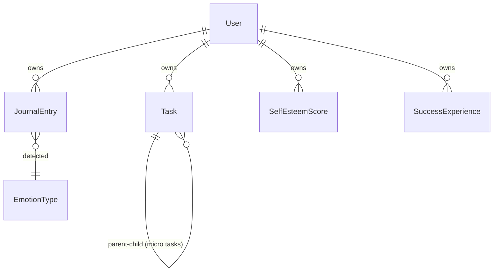

# データモデル設計

## 概要

Kokosidのデータモデルは、プライバシーファースト設計に基づき、ローカルストレージとクラウド同期の両方に対応しています。

## エンティティ関連図



## 主要エンティティ

### User（ユーザー）

ユーザーの基本情報と設定を管理します。

| フィールド           | 型        | 説明                          | 必須 |
| -------------------- | --------- | ----------------------------- | ---- |
| id                   | Id        | Isar自動採番ID                | ✅   |
| uuid                 | String    | UUID v4 (外部識別子)          | ✅   |
| name                 | String?   | ユーザー名                    |      |
| timezone             | String?   | タイムゾーン (例: Asia/Tokyo) |      |
| onboardingCompleted  | bool      | オンボーディング完了フラグ    | ✅   |
| createdAt            | DateTime  | 作成日時                      | ✅   |
| lastActiveAt         | DateTime? | 最終アクティブ日時            |      |
| notificationsEnabled | bool      | 通知有効フラグ                | ✅   |
| preferredLanguage    | String?   | 優先言語 (ja, en)             |      |

**インデックス:** `uuid`

### Task（タスク）

タスクとマイクロタスクを管理します。

| フィールド       | 型           | 説明                            | 必須 |
| ---------------- | ------------ | ------------------------------- | ---- |
| id               | Id           | Isar自動採番ID                  | ✅   |
| uuid             | String       | UUID v4                         | ✅   |
| userUuid         | String       | 所有ユーザーUUID                | ✅   |
| title            | String       | タスクタイトル                  | ✅   |
| description      | String?      | タスク説明                      |      |
| originalTaskUuid | String?      | 親タスクUUID (マイクロタスク用) |      |
| isMicroTask      | bool         | マイクロタスクフラグ            | ✅   |
| estimatedMinutes | int?         | 推定時間（分）                  |      |
| context          | String?      | コンテキスト情報                |      |
| completedAt      | DateTime?    | 完了日時                        |      |
| createdAt        | DateTime     | 作成日時                        | ✅   |
| dueDate          | DateTime?    | 期限日時                        |      |
| priority         | TaskPriority | 優先度                          | ✅   |
| status           | TaskStatus   | ステータス                      | ✅   |

**インデックス:** `uuid`, `userUuid`

**列挙型:**

```dart
enum TaskPriority { low, medium, high, urgent }
enum TaskStatus { pending, inProgress, completed, cancelled }
```

### JournalEntry（日記エントリ）

日記と感情分析結果を管理します。

| フィールド          | 型           | 説明                           | 必須 |
| ------------------- | ------------ | ------------------------------ | ---- |
| id                  | Id           | Isar自動採番ID                 | ✅   |
| uuid                | String       | UUID v4                        | ✅   |
| userUuid            | String       | 所有ユーザーUUID               | ✅   |
| encryptedContent    | String?      | 暗号化済みコンテンツ (AES-256) |      |
| audioUrl            | String?      | 音声ファイルパス               |      |
| transcription       | String?      | 音声テキスト変換結果           |      |
| emotionDetected     | EmotionType? | 検出された感情                 |      |
| emotionConfidence   | double?      | 感情信頼度 (0.0-1.0)           |      |
| aiReflection        | String?      | AIリフレーミング               |      |
| encryptedAiResponse | String?      | 暗号化済みAI応答               |      |
| createdAt           | DateTime     | 作成日時                       | ✅   |
| syncedAt            | DateTime?    | 同期日時                       |      |
| isEncrypted         | bool         | 暗号化フラグ                   | ✅   |

**インデックス:** `uuid`, `userUuid`, `createdAt`

**列挙型:**

```dart
enum EmotionType {
  happy,    // 喜び
  sad,      // 悲しみ
  angry,    // 怒り
  anxious,  // 不安
  tired,    // 疲労
  neutral,  // 中立
}
```

### SelfEsteemScore（自己肯定感スコア）

自己肯定感スコアの履歴を管理します。

| フィールド           | 型       | 説明               | 必須 |
| -------------------- | -------- | ------------------ | ---- |
| id                   | Id       | Isar自動採番ID     | ✅   |
| uuid                 | String   | UUID v4            | ✅   |
| userUuid             | String   | 所有ユーザーUUID   | ✅   |
| score                | double   | スコア (0.0-1.0)   | ✅   |
| calculationBasisJson | String?  | 算出根拠 (JSON)    |      |
| completionRate       | double?  | タスク完了率       |      |
| positiveEmotionRatio | double?  | ポジティブ感情比率 |      |
| streakScore          | double?  | 継続日数スコア     |      |
| engagementScore      | double?  | AI対話頻度スコア   |      |
| measuredAt           | DateTime | 測定日時           | ✅   |

**インデックス:** `uuid`, `userUuid`, `measuredAt`

**スコアレベル:**

```dart
enum ScoreLevel {
  excellent,  // >= 0.8 (素晴らしい状態です)
  good,       // >= 0.6 (良い調子です)
  fair,       // >= 0.4 (普通の状態です)
  poor,       // >= 0.2 (少し疲れ気味です)
  veryPoor,   // < 0.2 (休息が必要です)
}
```

### SuccessExperience（成功体験）

過去の成功体験を記録し、困難な時期に活用します。

| フィールド      | 型           | 説明             | 必須 |
| --------------- | ------------ | ---------------- | ---- |
| id              | Id           | Isar自動採番ID   | ✅   |
| uuid            | String       | UUID v4          | ✅   |
| userUuid        | String       | 所有ユーザーUUID | ✅   |
| title           | String       | 成功体験タイトル | ✅   |
| description     | String?      | 詳細説明         |      |
| emotionAtTime   | EmotionType? | 当時の感情       |      |
| lessonsLearned  | String?      | 学んだこと       |      |
| createdAt       | DateTime     | 作成日時         | ✅   |
| relatedTaskUuid | String?      | 関連タスクUUID   |      |

**インデックス:** `uuid`, `userUuid`

## スコア計算ロジック

### 自己肯定感スコア

過去7日間のデータに基づいて算出されます。

```dart
score = (completionRate * 0.3) +      // タスク完了率: 30%
        (positiveRatio * 0.4) +       // ポジティブ感情比率: 40%
        (streakScore * 0.2) +         // 継続日数: 20%
        (engagementScore * 0.1)       // AI対話頻度: 10%
```

| 要素            | 重み | 算出方法                           |
| --------------- | ---- | ---------------------------------- |
| completionRate  | 30%  | 完了タスク / 全タスク              |
| positiveRatio   | 40%  | (happy + neutral件数) / 全感情件数 |
| streakScore     | 20%  | min(連続日数 / 7, 1.0)             |
| engagementScore | 10%  | min(日記エントリ数 / 7, 1.0)       |

## シリアライゼーション

### Web版 (Hive) のJSON形式

```json
// User
{
  "uuid": "550e8400-e29b-41d4-a716-446655440000",
  "name": "ユーザー名",
  "timezone": "Asia/Tokyo",
  "onboardingCompleted": true,
  "createdAt": "2026-02-01T10:00:00.000Z",
  "lastActiveAt": "2026-02-02T15:30:00.000Z",
  "notificationsEnabled": true,
  "preferredLanguage": "ja"
}

// Task
{
  "uuid": "...",
  "userUuid": "...",
  "title": "レポートを書く",
  "isMicroTask": false,
  "estimatedMinutes": 30,
  "createdAt": "2026-02-02T09:00:00.000Z",
  "priority": "medium",
  "status": "pending"
}
```

## 暗号化

### 対象フィールド

- `JournalEntry.encryptedContent`
- `JournalEntry.encryptedAiResponse`

### 暗号化方式

- **アルゴリズム:** AES-256-GCM
- **キー保存:** Flutter Secure Storage (デバイス固有)
- **サーバー:** 暗号化データのみ保存、復号キーは保持しない

## 関連ドキュメント

- [ストレージアーキテクチャ](storage-architecture.md)
- [正確性プロパティ](properties.md)
- [要件定義](requirements.md)
