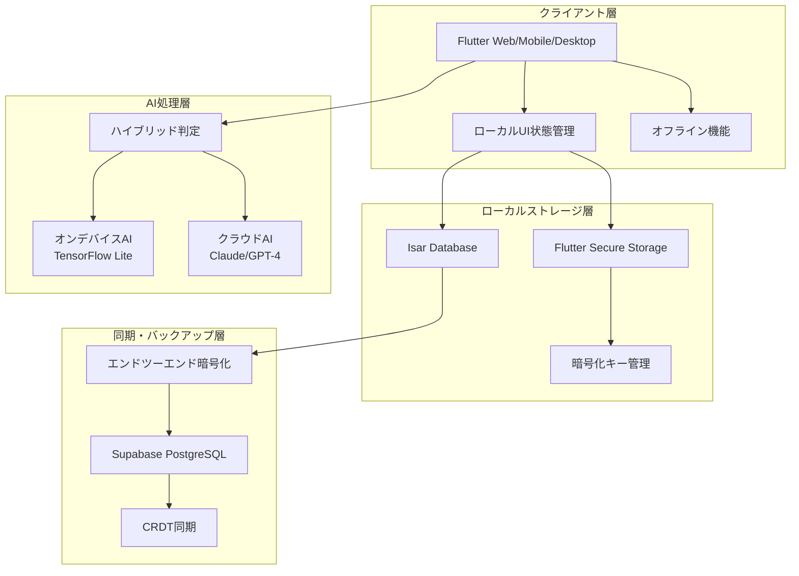

# 設計書

## 概要

Kokosidは、ACT（受容とコミットメント・セラピー）の心理学的フレームワークを基盤とした次世代自己管理パートナーアプリケーションです。「ココロ（心）」＋「Side（そばに）」の名前の通り、ユーザーの心に寄り添い、実行機能の補完と自己肯定感の向上を同時に実現します。

本設計では、マイクロ・チャンキング、音声感情分析、プレシジョン・ナッジング、エンドツーエンド暗号化を核とした包括的なシステムを構築します。

## アーキテクチャ

### システム全体構成

Kokosidは、ローカルファースト設計とクラウド同期を組み合わせたハイブリッドアーキテクチャを採用します。プライバシーを最優先しながら、複数デバイス間でのシームレスな体験を実現します。



### 技術スタック

| 層 | 技術 | 選定理由 |
|---|------|---------|
| **フロントエンド** | Flutter | 単一コードベースでマルチプラットフォーム対応、60fps以上のスムーズなアニメーション |
| **ローカルDB** | Isar Database | 高速NoSQL、リアルタイム検索、SQLiteの5倍以上の速度 |
| **暗号化ストレージ** | Flutter Secure Storage | 生体認証統合、ハードウェアセキュリティモジュール対応 |
| **同期・バックアップ** | Supabase | PostgreSQL + Realtime、Row Level Security、エンドツーエンド暗号化対応 |
| **オンデバイスAI** | TensorFlow Lite + Llama 3.2 | オフライン動作、完全プライバシー保護 |
| **クラウドAI** | Claude Sonnet 4.5 / GPT-4 | 高度な共感的対話、ACT技法の適用 |

## コンポーネントと インターフェース

### 主要コンポーネント

#### 1. マイクロ・チャンキング・エンジン

```dart
class MicroChunkingEngine {
  final AIService _aiService;
  final TaskRepository _taskRepo;
  
  /// タスクを5分以内の極小ステップに分解
  Future<List<MicroTask>> decomposeTask(Task originalTask) async {
    final prompt = _buildDecompositionPrompt(originalTask);
    final response = await _aiService.complete(prompt);
    
    return _parseStepsFromResponse(response)
      .where((step) => step.estimatedMinutes <= 5)
      .take(7) // 認知負荷軽減のため最大7ステップ
      .toList();
  }
  
  String _buildDecompositionPrompt(Task task) {
    return '''
    あなたはADHD特性を持つ人のタスク分解専門家です。
    
    【入力タスク】
    タイトル: "${task.title}"
    推定時間: ${task.estimatedMinutes}分
    
    【分解の原則】
    1. 各ステップは5分以内で完了できる
    2. 具体的な動詞で始める（「考える」ではなく「3つ書き出す」）
    3. 成功条件が明確（チェックボックスで判定可能）
    4. 最初のステップは「準備」ではなく「実行」から始める
    5. 最大7ステップまで（認知負荷軽減）
    
    JSON形式で出力してください。
    ''';
  }
}
```

#### 2. ACT対話エンジン

```dart
class ACTDialogueEngine {
  final EmotionAnalyzer _emotionAnalyzer;
  final UserContextService _contextService;
  
  /// ACTの6つのコアプロセスに基づいた応答生成
  Future<String> generateResponse(String userInput) async {
    // 1. 感情・思考パターンの抽出
    final emotion = await _emotionAnalyzer.analyze(userInput);
    final context = await _contextService.getUserContext();
    
    // 2. 最適なACTプロセスの選択
    final process = _selectACTProcess(emotion, context);
    
    // 3. パーソナライズされた応答生成
    return await _generatePersonalizedResponse(process, emotion, context);
  }
  
  ACTProcess _selectACTProcess(Emotion emotion, UserContext context) {
    if (emotion.isNegative && context.emotionTrend.isDecreasing) {
      return ACTProcess.acceptance; // 受容
    } else if (emotion.type == EmotionType.selfCriticism) {
      return ACTProcess.defusion; // 認知的脱フュージョン
    } else if (context.motivationLevel < 0.3) {
      return ACTProcess.values; // 価値の明確化
    } else {
      return ACTProcess.committedAction; // コミットされた行動
    }
  }
}
```

#### 3. 3層感情分析システム

```dart
class EmotionAnalyzer {
  final AcousticAnalyzer _acousticAnalyzer;
  final WhisperService _whisperService;
  final BERTEmotionClassifier _bertClassifier;
  
  /// 音声から多層的な感情分析を実行
  Future<EmotionResult> analyzeAudio(File audioFile) async {
    // Layer 1: 音響特徴分析（オンデバイス）
    final acousticFeatures = await _acousticAnalyzer.extractFeatures(audioFile);
    
    // Layer 2: テキスト変換と言語分析
    final transcription = await _whisperService.transcribe(audioFile);
    final textEmotion = await _bertClassifier.classify(transcription);
    
    // Layer 3: コンテキスト統合分析
    final history = await _getEmotionHistory(days: 7);
    final trend = _analyzeTrend(history);
    
    // 総合スコア計算（重み付き平均）
    return EmotionResult(
      primaryEmotion: _combineResults(acousticFeatures, textEmotion),
      confidence: _calculateConfidence(acousticFeatures, textEmotion),
      trend: trend,
      transcription: transcription,
    );
  }
  
  Emotion _combineResults(AcousticFeatures acoustic, TextEmotion text) {
    // 音響50%、テキスト50%の重み付き統合
    final combinedScores = <EmotionType, double>{};
    
    for (final emotion in EmotionType.values) {
      combinedScores[emotion] = 
        (acoustic.emotionScores[emotion]! * 0.5) +
        (text.emotionScores[emotion]! * 0.5);
    }
    
    return Emotion.fromScores(combinedScores);
  }
}
```

#### 4. プレシジョン・ナッジング・システム

```dart
class PrecisionNudgingSystem {
  final ProductiveHourPredictor _hourPredictor;
  final EmotionAnalyzer _emotionAnalyzer;
  final NotificationService _notificationService;
  
  /// 最適なタイミングと内容で通知を送信
  Future<void> scheduleOptimalNotification(Task task) async {
    // 1. ユーザー状態を取得
    final userState = await _getCurrentUserState();
    
    // 2. 最適な時間を予測
    final optimalHour = await _hourPredictor.predictOptimalTime(
      userState.userId, 
      task
    );
    
    // 3. 心理状態に応じたトーンを決定
    final tone = _determineTone(userState.recentEmotion);
    
    // 4. パーソナライズされたメッセージを生成
    final message = _generateMessage(task, tone, userState);
    
    // 5. 通知をスケジュール
    await _notificationService.schedule(
      message: message,
      scheduledTime: _getNextOccurrence(optimalHour),
      retryStrategy: _getRetryStrategy(tone),
    );
  }
  
  NotificationTone _determineTone(Emotion recentEmotion) {
    switch (recentEmotion.type) {
      case EmotionType.anxious:
      case EmotionType.tired:
        return NotificationTone.gentle;
      case EmotionType.happy:
        return NotificationTone.encouraging;
      default:
        return NotificationTone.neutral;
    }
  }
}
```

## データモデル

### 主要エンティティ

#### User（ユーザー）

```dart
@collection
class User {
  Id id = Isar.autoIncrement;
  
  @Index()
  late String uuid; // UUID v4
  
  String? name;
  String? timezone; // 例: Asia/Tokyo
  bool onboardingCompleted = false;
  DateTime createdAt = DateTime.now();
  
  // 暗号化キー（Secure Storageに保存、DBには保存しない）
  // String encryptionKey; // ← これはSecure Storageのみ
}
```

#### Task（タスク）

```dart
@collection
class Task {
  Id id = Isar.autoIncrement;
  
  @Index()
  late String uuid;
  
  @Index()
  late String userUuid;
  
  late String title;
  String? originalTaskUuid; // 親タスクID（マイクロタスクの場合）
  bool isMicroTask = false;
  int? estimatedMinutes;
  String? context;
  DateTime? completedAt;
  DateTime createdAt = DateTime.now();
  
  // リレーション
  @Backlink(to: 'originalTaskUuid')
  final microTasks = IsarLinks<Task>();
}
```

#### JournalEntry（日記エントリ）

```dart
@collection
class JournalEntry {
  Id id = Isar.autoIncrement;
  
  @Index()
  late String uuid;
  
  @Index()
  late String userUuid;
  
  String? encryptedContent; // AES-256で暗号化済み
  String? audioUrl; // ローカルパスまたは暗号化URL
  
  @Enumerated(EnumType.name)
  EmotionType? emotionDetected;
  
  double? emotionConfidence; // 0.0 ~ 1.0
  String? aiReflection; // AIリフレーミング
  
  @Index()
  DateTime createdAt = DateTime.now();
  
  DateTime? syncedAt;
}
```

#### SelfEsteemScore（自己肯定感スコア）

```dart
@collection
class SelfEsteemScore {
  Id id = Isar.autoIncrement;
  
  @Index()
  late String uuid;
  
  @Index()
  late String userUuid;
  
  late double score; // 0.0 ~ 1.0
  String? calculationBasisJson; // スコア算出の根拠データ（JSON）
  
  @Index()
  DateTime measuredAt = DateTime.now();
}
```

### 自己肯定感スコア計算ロジック

```dart
class SelfEsteemCalculator {
  // デフォルト重み係数
  static const double COMPLETION_WEIGHT = 0.3;
  static const double EMOTION_WEIGHT = 0.4;
  static const double STREAK_WEIGHT = 0.2;
  static const double ENGAGEMENT_WEIGHT = 0.1;
  
  Future<double> calculateScore(String userUuid) async {
    final recentData = await _getRecentData(userUuid, days: 7);
    
    // 1. タスク完了率（0.0 ~ 1.0）
    final completionRate = recentData.totalTasks > 0
        ? recentData.completedTasks / recentData.totalTasks
        : 0.5;
    
    // 2. ポジティブ感情比率（0.0 ~ 1.0）
    final positiveEmotions = [EmotionType.happy, EmotionType.neutral];
    final positiveCount = recentData.emotions
        .where((e) => positiveEmotions.contains(e))
        .length;
    final positiveRatio = recentData.emotions.isNotEmpty
        ? positiveCount / recentData.emotions.length
        : 0.5;
    
    // 3. 継続日数スコア（0.0 ~ 1.0）
    final streakScore = math.min(recentData.consecutiveDays / 7, 1.0);
    
    // 4. AI対話頻度スコア（0.0 ~ 1.0）
    final engagementScore = math.min(recentData.journalEntries / 7, 1.0);
    
    // 重み付き合計
    final score = (completionRate * COMPLETION_WEIGHT) +
                  (positiveRatio * EMOTION_WEIGHT) +
                  (streakScore * STREAK_WEIGHT) +
                  (engagementScore * ENGAGEMENT_WEIGHT);
    
    return math.max(0.0, math.min(1.0, score)); // 0.0-1.0の範囲に制限
  }
}
```
## 正確性プロパティ

*プロパティとは、システムの全ての有効な実行において真であるべき特性や動作です。プロパティは人間が読める仕様と機械で検証可能な正確性保証の橋渡しとして機能します。*

### プロパティ1: マイクロ・チャンキング制約の遵守

*全ての*タスクに対して、分解されたステップは以下の制約を満たす：各ステップの推定時間が5分以内、具体的動詞で開始、成功条件が明確、最初のステップが実行系、総ステップ数が7個以下

**検証: 要件 1.1, 1.2, 1.3, 1.4, 1.5**

### プロパティ2: ACT対話プロセスの適切な選択

*全ての*ユーザー入力に対して、システムは感情状態と文脈に基づいてACTの6つのコアプロセス（受容、脱フュージョン、価値明確化、コミットされた行動、マインドフルネス、観察する自己）のうち最適なものを選択し、対応する技法を適用する

**検証: 要件 2.1, 2.2, 2.3, 2.5**

### プロパティ3: 個別化された対話応答の生成

*全ての*対話において、システムは過去の対話履歴を参照し、同一入力でも履歴によって異なる個別化された応答を生成する

**検証: 要件 2.4**

### プロパティ4: 3層感情分析の統合処理

*全ての*音声入力に対して、システムは音響特徴分析、テキスト分析、コンテキスト分析の3層を実行し、重み付き統合により総合的な感情スコアを算出する

**検証: 要件 3.1, 3.3, 3.5**

### プロパティ5: 音声認識精度の保証

*全ての*日本語音声入力に対して、システムは95%以上の精度でテキスト変換を実行する

**検証: 要件 3.2**

### プロパティ6: 感情分類の完全性

*全ての*テキスト入力に対して、システムは6つの感情カテゴリ（喜び、悲しみ、怒り、不安、疲労、中立）のいずれか1つに分類し、トレンド分析（改善・悪化・安定）を実行する

**検証: 要件 3.3, 3.4**

### プロパティ7: 心理状態適応型通知システム

*全ての*通知送信において、システムは現在の心理状態に応じて適切なトーン（優しい・励まし・中立）を選択し、不安/疲労状態では30分後再送、ポジティブ状態では即時送信を適用する

**検証: 要件 4.2, 4.3, 4.4**

### プロパティ8: 生産的時間帯学習の実行

*全ての*十分なデータを持つユーザーに対して、システムは過去30日間のタスク完了データから生産的時間帯パターンを学習し、最適な通知タイミングを予測する

**検証: 要件 4.1**

### プロパティ9: 達成感演出の連続完了対応

*全ての*連続完了3個以上の状況において、システムは特別な達成感を演出する通知を送信する

**検証: 要件 4.5**

### プロパティ10: エンドツーエンド暗号化の完全性

*全ての*ユーザーデータに対して、システムはローカルでAES-256暗号化を実行してからサーバー送信し、サーバー側では暗号化データのみを保持し、復号化キーを一切持たない

**検証: 要件 5.2, 5.3**

### プロパティ11: データ削除の完全実行

*全ての*データ削除要求に対して、システムは30日以内にローカル・サーバー両方から全データを完全削除する

**検証: 要件 5.4**

### プロパティ12: オフライン機能の完全動作

*全ての*ネットワーク切断状態において、システムは基本機能（タスク管理、日記記録）を完全に動作させる

**検証: 要件 5.5**

### プロパティ13: 自己肯定感スコア計算の一貫性

*全ての*スコア算出において、システムは過去7日間のタスク完了率（30%）、ポジティブ感情比率（40%）、継続日数（20%）、AI対話頻度（10%）の重み係数を適用し、0.0-1.0の範囲でスコアを算出する

**検証: 要件 6.1, 6.2**

### プロパティ14: 進歩認識と可視化の提供

*全ての*スコア確認時において、システムは推移グラフと算出根拠を表示し、0.05ポイント以上の向上で承認メッセージを表示する

**検証: 要件 6.3, 6.4**

### プロパティ15: タスク完了時のアニメーション表示

*全ての*タスク完了において、システムはタスク規模に応じて適切なアニメーション（5分:キラキラ星1秒、15分:紙吹雪1.5秒、連続達成:ストリーク炎ループ）を表示し、パーソナライズされた賞賛メッセージを生成する

**検証: 要件 7.1, 7.2, 7.3, 7.4**

### プロパティ16: 成功体験の記録と活用

*全ての*困難な時期において、システムは過去の成功体験を記録から検索し、適切なタイミングで思い出させる機能を提供する

**検証: 要件 7.5**

### プロパティ17: パフォーマンス品質の維持

*全ての*画面において、システムは60fps以上のスムーズなアニメーションを維持する

**検証: 要件 8.5**

## エラーハンドリング

### 1. AI API障害時の対応

```dart
class AIServiceWithFallback {
  Future<String> generateResponse(String input) async {
    try {
      // クラウドAI（Claude/GPT-4）を試行
      return await _cloudAI.complete(input);
    } on NetworkException {
      // ネットワーク障害時はローカルAIにフォールバック
      return await _localAI.complete(input);
    } on APIQuotaException {
      // API制限時は事前定義済み応答を使用
      return _getFallbackResponse(input);
    }
  }
}
```

### 2. 暗号化キー紛失時の対応

```dart
class EncryptionKeyRecovery {
  Future<void> handleKeyLoss() async {
    // 1. ユーザーに状況を説明
    await _showKeyLossDialog();
    
    // 2. 新しいキーを生成
    final newKey = await _generateNewEncryptionKey();
    
    // 3. 既存の暗号化データは復号不可能であることを警告
    await _showDataLossWarning();
    
    // 4. 新しいセッションとして開始
    await _initializeNewSession(newKey);
  }
}
```

### 3. 同期競合の解決

```dart
class ConflictResolver {
  Future<void> resolveConflict(ConflictData conflict) async {
    switch (conflict.type) {
      case ConflictType.taskCompletion:
        // タスク完了の競合：完了を優先（Add-Wins戦略）
        await _resolveTaskCompletion(conflict);
        break;
      case ConflictType.userSettings:
        // 設定の競合：最新を優先（Last-Write-Wins戦略）
        await _resolveUserSettings(conflict);
        break;
      case ConflictType.journalEntry:
        // 日記エントリの競合：両方を保持（Multi-Value戦略）
        await _resolveJournalEntry(conflict);
        break;
    }
  }
}
```

## テスト戦略

### デュアルテストアプローチ

Kokosidでは、ユニットテストとプロパティベーステストの両方を活用した包括的なテスト戦略を採用します。

#### ユニットテスト

**対象:**
- 特定の例とエッジケース
- コンポーネント間の統合ポイント
- エラー条件と境界値

**例:**
```dart
test('初回起動時に暗号化キーが生成される', () async {
  // Given: 新しいデバイス
  await _clearSecureStorage();
  
  // When: アプリを初回起動
  await encryptionService.initialize();
  
  // Then: 暗号化キーが生成・保存される
  final key = await secureStorage.read(key: 'encryption_key');
  expect(key, isNotNull);
  expect(key!.length, equals(44)); // Base64エンコードされた256bitキー
});
```

#### プロパティベーステスト

**設定:**
- 最小100回の反復実行
- 各テストは設計書のプロパティを参照
- タグ形式: **Feature: act-based-self-management, Property {番号}: {プロパティテキスト}**

**例:**
```dart
// Feature: act-based-self-management, Property 1: マイクロ・チャンキング制約の遵守
testProperty('全てのタスクが適切に分解される', () {
  forAll(taskGenerator, (task) async {
    // When: タスクを分解
    final steps = await microChunkingEngine.decomposeTask(task);
    
    // Then: 全ての制約を満たす
    expect(steps.length, lessThanOrEqualTo(7));
    expect(steps.every((s) => s.estimatedMinutes <= 5), isTrue);
    expect(steps.every((s) => s.action.startsWithActionVerb()), isTrue);
    expect(steps.every((s) => s.successCriteria.isNotEmpty), isTrue);
    expect(steps.first.action.isExecutionAction(), isTrue);
  });
});

// Feature: act-based-self-management, Property 13: 自己肯定感スコア計算の一貫性
testProperty('自己肯定感スコアが正しく計算される', () {
  forAll(userDataGenerator, (userData) async {
    // When: スコアを計算
    final score = await calculator.calculateScore(userData.userUuid);
    
    // Then: 0.0-1.0の範囲内で重み係数が適用される
    expect(score, inInclusiveRange(0.0, 1.0));
    
    // 重み係数の検証
    final basis = await calculator.getCalculationBasis(userData.userUuid);
    final expectedScore = 
      (basis.completionRate * 0.3) +
      (basis.positiveRatio * 0.4) +
      (basis.streakScore * 0.2) +
      (basis.engagementScore * 0.1);
    
    expect(score, closeTo(expectedScore, 0.001));
  });
});
```

### テストライブラリ選定

- **プロパティベーステスト**: `test_property` パッケージ（Dart/Flutter用）
- **ユニットテスト**: `flutter_test` 標準パッケージ
- **統合テスト**: `integration_test` パッケージ
- **モック**: `mockito` パッケージ

### テスト実行設定

```yaml
# pubspec.yaml
dev_dependencies:
  flutter_test:
    sdk: flutter
  test_property: ^1.0.0
  mockito: ^5.4.0
  integration_test:
    sdk: flutter

# test/property_test_config.dart
const int PROPERTY_TEST_ITERATIONS = 100;
const Duration PROPERTY_TEST_TIMEOUT = Duration(minutes: 5);
```

この設計により、Kokosidは心理学的に根拠のあるACTフレームワークと最新のAI技術を組み合わせ、ユーザーの心に寄り添う真のパートナーアプリケーションとして機能します。