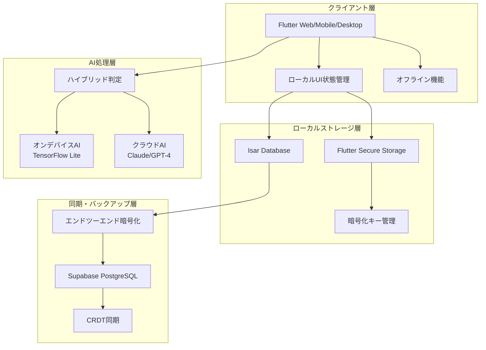

# 設計書

## 概要

Kokosidは、ACT（受容とコミットメント・セラピー）の心理学的フレームワークを基盤とした次世代自己管理パートナーアプリケーションです。「ココロ（心）」＋「Side（そばに）」の名前の通り、ユーザーの心に寄り添い、実行機能の補完と自己肯定感の向上を同時に実現します。

本設計では、マイクロ・チャンキング、音声感情分析、プレシジョン・ナッジング、エンドツーエンド暗号化を核とした包括的なシステムを構築します。

## 関連ドキュメント

| ドキュメント                                          | 内容                                         |
| ----------------------------------------------------- | -------------------------------------------- |
| [要件定義](requirements.md)                           | 機能要件・非機能要件                         |
| [ストレージ・アーキテクチャ](storage-architecture.md) | Web/ネイティブ分離、Isar/Hive実装詳細        |
| [データモデル](data-models.md)                        | エンティティ定義、リレーション、シリアライズ |
| [正確性プロパティ](properties.md)                     | 17件のシステムプロパティ定義                 |
| [テスト戦略](test-strategy.md)                        | テストピラミッド、プロパティベーステスト     |
| [タスク](tasks.md)                                    | 実装タスク一覧                               |
| [エラーハンドリング要約](ERROR_HANDLING_SUMMARY.md)   | エラー処理パターン                           |
| [実装メモ](IMPLEMENTATION_NOTES.md)                   | 開発時の注意点                               |

## アーキテクチャ

### システム全体構成

Kokosidは、ローカルファースト設計とクラウド同期を組み合わせたハイブリッドアーキテクチャを採用します。プライバシーを最優先しながら、複数デバイス間でのシームレスな体験を実現します。



### 技術スタック

| 層                     | 技術                        | 選定理由                                                                          |
| ---------------------- | --------------------------- | --------------------------------------------------------------------------------- |
| **フロントエンド**     | Flutter                     | 単一コードベースでマルチプラットフォーム対応、60fps以上のスムーズなアニメーション |
| **ローカルDB**         | Isar Database               | 高速NoSQL、リアルタイム検索、SQLiteの5倍以上の速度                                |
| **暗号化ストレージ**   | Flutter Secure Storage      | 生体認証統合、ハードウェアセキュリティモジュール対応                              |
| **同期・バックアップ** | Supabase                    | PostgreSQL + Realtime、Row Level Security、エンドツーエンド暗号化対応             |
| **オンデバイスAI**     | TensorFlow Lite + Llama 3.2 | オフライン動作、完全プライバシー保護                                              |
| **クラウドAI**         | Claude Sonnet 4.5 / GPT-4   | 高度な共感的対話、ACT技法の適用                                                   |

## コンポーネントと インターフェース

### 主要コンポーネント

#### 1. マイクロ・チャンキング・エンジン

```dart
class MicroChunkingEngine {
  final AIService _aiService;
  final TaskRepository _taskRepo;

  /// タスクを5分以内の極小ステップに分解
  Future<List<MicroTask>> decomposeTask(Task originalTask) async {
    final prompt = _buildDecompositionPrompt(originalTask);
    final response = await _aiService.complete(prompt);

    return _parseStepsFromResponse(response)
      .where((step) => step.estimatedMinutes <= 5)
      .take(7) // 認知負荷軽減のため最大7ステップ
      .toList();
  }

  String _buildDecompositionPrompt(Task task) {
    return '''
    あなたはADHD特性を持つ人のタスク分解専門家です。

    【入力タスク】
    タイトル: "${task.title}"
    推定時間: ${task.estimatedMinutes}分

    【分解の原則】
    1. 各ステップは5分以内で完了できる
    2. 具体的な動詞で始める（「考える」ではなく「3つ書き出す」）
    3. 成功条件が明確（チェックボックスで判定可能）
    4. 最初のステップは「準備」ではなく「実行」から始める
    5. 最大7ステップまで（認知負荷軽減）

    JSON形式で出力してください。
    ''';
  }
}
```

#### 2. ACT対話エンジン

```dart
class ACTDialogueEngine {
  final EmotionAnalyzer _emotionAnalyzer;
  final UserContextService _contextService;

  /// ACTの6つのコアプロセスに基づいた応答生成
  Future<String> generateResponse(String userInput) async {
    // 1. 感情・思考パターンの抽出
    final emotion = await _emotionAnalyzer.analyze(userInput);
    final context = await _contextService.getUserContext();

    // 2. 最適なACTプロセスの選択
    final process = _selectACTProcess(emotion, context);

    // 3. パーソナライズされた応答生成
    return await _generatePersonalizedResponse(process, emotion, context);
  }

  ACTProcess _selectACTProcess(Emotion emotion, UserContext context) {
    if (emotion.isNegative && context.emotionTrend.isDecreasing) {
      return ACTProcess.acceptance; // 受容
    } else if (emotion.type == EmotionType.selfCriticism) {
      return ACTProcess.defusion; // 認知的脱フュージョン
    } else if (context.motivationLevel < 0.3) {
      return ACTProcess.values; // 価値の明確化
    } else {
      return ACTProcess.committedAction; // コミットされた行動
    }
  }
}
```

#### 3. 3層感情分析システム

```dart
class EmotionAnalyzer {
  final AcousticAnalyzer _acousticAnalyzer;
  final WhisperService _whisperService;
  final BERTEmotionClassifier _bertClassifier;

  /// 音声から多層的な感情分析を実行
  Future<EmotionResult> analyzeAudio(File audioFile) async {
    // Layer 1: 音響特徴分析（オンデバイス）
    final acousticFeatures = await _acousticAnalyzer.extractFeatures(audioFile);

    // Layer 2: テキスト変換と言語分析
    final transcription = await _whisperService.transcribe(audioFile);
    final textEmotion = await _bertClassifier.classify(transcription);

    // Layer 3: コンテキスト統合分析
    final history = await _getEmotionHistory(days: 7);
    final trend = _analyzeTrend(history);

    // 総合スコア計算（重み付き平均）
    return EmotionResult(
      primaryEmotion: _combineResults(acousticFeatures, textEmotion),
      confidence: _calculateConfidence(acousticFeatures, textEmotion),
      trend: trend,
      transcription: transcription,
    );
  }

  Emotion _combineResults(AcousticFeatures acoustic, TextEmotion text) {
    // 音響50%、テキスト50%の重み付き統合
    final combinedScores = <EmotionType, double>{};

    for (final emotion in EmotionType.values) {
      combinedScores[emotion] =
        (acoustic.emotionScores[emotion]! * 0.5) +
        (text.emotionScores[emotion]! * 0.5);
    }

    return Emotion.fromScores(combinedScores);
  }
}
```

#### 4. プレシジョン・ナッジング・システム

```dart
class PrecisionNudgingSystem {
  final ProductiveHourPredictor _hourPredictor;
  final EmotionAnalyzer _emotionAnalyzer;
  final NotificationService _notificationService;

  /// 最適なタイミングと内容で通知を送信
  Future<void> scheduleOptimalNotification(Task task) async {
    // 1. ユーザー状態を取得
    final userState = await _getCurrentUserState();

    // 2. 最適な時間を予測
    final optimalHour = await _hourPredictor.predictOptimalTime(
      userState.userId,
      task
    );

    // 3. 心理状態に応じたトーンを決定
    final tone = _determineTone(userState.recentEmotion);

    // 4. パーソナライズされたメッセージを生成
    final message = _generateMessage(task, tone, userState);

    // 5. 通知をスケジュール
    await _notificationService.schedule(
      message: message,
      scheduledTime: _getNextOccurrence(optimalHour),
      retryStrategy: _getRetryStrategy(tone),
    );
  }

  NotificationTone _determineTone(Emotion recentEmotion) {
    switch (recentEmotion.type) {
      case EmotionType.anxious:
      case EmotionType.tired:
        return NotificationTone.gentle;
      case EmotionType.happy:
        return NotificationTone.encouraging;
      default:
        return NotificationTone.neutral;
    }
  }
}
```

## データモデル

データモデルの詳細については [data-models.md](data-models.md) を参照してください。

### 主要エンティティ概要

| エンティティ    | 説明                                                     |
| --------------- | -------------------------------------------------------- |
| User            | ユーザー情報（UUID、タイムゾーン、オンボーディング状態） |
| Task            | タスク・マイクロタスク情報                               |
| JournalEntry    | 日記エントリ（暗号化コンテンツ、感情分析結果）           |
| SelfEsteemScore | 自己肯定感スコア（計算結果と根拠）                       |

## 正確性プロパティ

システムの正確性プロパティ（17件）については [properties.md](properties.md) を参照してください。

## エラーハンドリング

### 1. AI API障害時の対応

```dart
class AIServiceWithFallback {
  Future<String> generateResponse(String input) async {
    try {
      // クラウドAI（Claude/GPT-4）を試行
      return await _cloudAI.complete(input);
    } on NetworkException {
      // ネットワーク障害時はローカルAIにフォールバック
      return await _localAI.complete(input);
    } on APIQuotaException {
      // API制限時は事前定義済み応答を使用
      return _getFallbackResponse(input);
    }
  }
}
```

### 2. 暗号化キー紛失時の対応

```dart
class EncryptionKeyRecovery {
  Future<void> handleKeyLoss() async {
    // 1. ユーザーに状況を説明
    await _showKeyLossDialog();

    // 2. 新しいキーを生成
    final newKey = await _generateNewEncryptionKey();

    // 3. 既存の暗号化データは復号不可能であることを警告
    await _showDataLossWarning();

    // 4. 新しいセッションとして開始
    await _initializeNewSession(newKey);
  }
}
```

### 3. 同期競合の解決

```dart
class ConflictResolver {
  Future<void> resolveConflict(ConflictData conflict) async {
    switch (conflict.type) {
      case ConflictType.taskCompletion:
        // タスク完了の競合：完了を優先（Add-Wins戦略）
        await _resolveTaskCompletion(conflict);
        break;
      case ConflictType.userSettings:
        // 設定の競合：最新を優先（Last-Write-Wins戦略）
        await _resolveUserSettings(conflict);
        break;
      case ConflictType.journalEntry:
        // 日記エントリの競合：両方を保持（Multi-Value戦略）
        await _resolveJournalEntry(conflict);
        break;
    }
  }
}
```

## テスト戦略

テスト戦略の詳細については [test-strategy.md](test-strategy.md) を参照してください。

### 概要

- **ユニットテスト**: 個別コンポーネントのテスト
- **プロパティベーステスト**: 仕様の正確性検証（100回以上の反復）
- **統合テスト**: コンポーネント間連携テスト
- **E2Eテスト**: ユーザーフロー全体のテスト

この設計により、Kokosidは心理学的に根拠のあるACTフレームワークと最新のAI技術を組み合わせ、ユーザーの心に寄り添う真のパートナーアプリケーションとして機能します。
