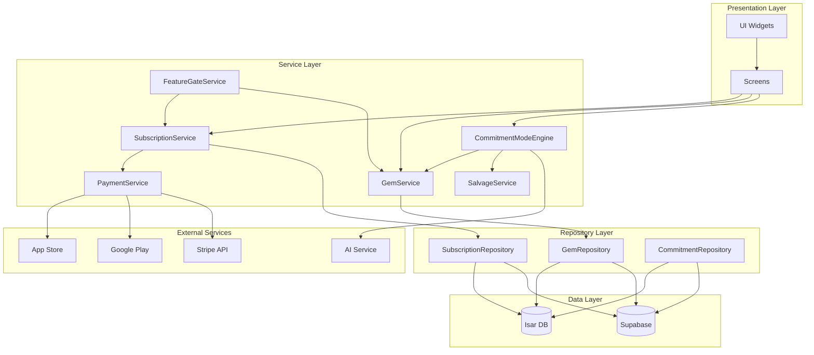

# 設計書：収益化システム

## 概要

本設計書は、Kokosidアプリケーションの収益化システムの技術的実装を定義します。このシステムは以下の主要コンポーネントで構成されます：

1. **サブスクリプション管理**: Proプラン（月額¥1,480）の購読、更新、キャンセル処理
2. **ジェム管理**: 仮想通貨「ジェム」の購入、消費、有効期限管理
3. **機能ゲート**: プレミアム機能（AIレポート、マルチデバイス同期）へのアクセス制御
4. **本気モード（Commitment Mode）**: ジェムステーキング、AI伴走、サルベージ機能を含む行動変容システム
5. **決済処理**: プラットフォーム固有の決済統合（iOS: In-App Purchase、Android: Play Billing、Web: Stripe）

### 設計原則

- **プライバシーファースト**: 決済情報は外部プロバイダーに委譲、個人データはE2E暗号化
- **オフライン対応**: ローカルファーストアーキテクチャで、オンライン復帰時に同期
- **プラットフォーム抽象化**: 決済ロジックをプラットフォーム固有の実装から分離
- **トランザクション整合性**: ジェム残高の変更は常にトランザクションログと共に記録
- **心理的安全性**: 失敗を受容し、正直さを報酬化する設計

## アーキテクチャ

### システム構成図



### レイヤー責務

#### Presentation Layer
- ユーザーインターフェースの表示
- ユーザー入力の受付
- サービス層への要求の委譲
- 状態の表示（ローディング、エラー、成功）

#### Service Layer
- ビジネスロジックの実装
- 複数リポジトリの調整
- トランザクション管理
- 外部サービスとの統合

#### Repository Layer
- データアクセスの抽象化
- ローカルストレージとクラウドストレージの同期
- CRUD操作の提供

#### Data Layer
- データの永続化
- クエリの実行
- インデックス管理

## コンポーネントとインターフェース

### 1. SubscriptionService

サブスクリプションのライフサイクル管理を担当するサービス。

```dart
class SubscriptionService {
  final SubscriptionRepository _repository;
  final PaymentService _paymentService;
  final GemService _gemService;
  
  /// Proプランを購読開始
  Future<SubscriptionResult> subscribeToPro(String userId);
  
  /// サブスクリプションをキャンセル
  Future<void> cancelSubscription(String userId);
  
  /// サブスクリプション状態を取得
  Future<SubscriptionStatus> getSubscriptionStatus(String userId);
  
  /// サブスクリプションを更新（月次）
  Future<void> renewSubscription(String userId);
  
  /// サブスクリプション状態を同期
  Future<void> syncSubscriptionStatus(String userId);
  
  /// 猶予期間を確認
  bool isInGracePeriod(Subscription subscription);
}

enum SubscriptionStatus {
  none,        // サブスクリプションなし
  active,      // アクティブ
  cancelled,   // キャンセル済み（期間終了まで有効）
  expired,     // 期限切れ
  gracePeriod, // 猶予期間中
}

class SubscriptionResult {
  final bool success;
  final String? errorMessage;
  final Subscription? subscription;
}
```

### 2. GemService

ジェムの購入、消費、有効期限管理を担当するサービス。

```dart
class GemService {
  final GemRepository _repository;
  final PaymentService _paymentService;
  
  /// ジェムを購入（12 Gems / ¥1,200）
  Future<GemPurchaseResult> purchaseGems(String userId);
  
  /// ジェムを消費
  Future<bool> consumeGems(String userId, int amount, String reason);
  
  /// ジェム残高を取得
  Future<GemBalance> getBalance(String userId);
  
  /// 期限切れジェムを削除
  Future<void> expireOldGems(String userId);
  
  /// Proプラン月次ジェムを付与
  Future<void> grantMonthlyGems(String userId);
  
  /// ジェムをステーク（保留）
  Future<bool> stakeGems(String userId, int amount, String taskId);
  
  /// ステークされたジェムを返却
  Future<void> returnStakedGems(String userId, String taskId);
  
  /// ステークされたジェムを没収
  Future<void> forfeitStakedGems(String userId, String taskId);
  
  /// ジェム使用履歴を取得
  Future<List<GemTransaction>> getTransactionHistory(String userId);
}

class GemBalance {
  final int availableGems;      // 利用可能ジェム
  final int pendingGems;        // ステーク中ジェム
  final int unlimitedGems;      // 無期限ジェム（Proプラン付与分）
  final DateTime? earliestExpiry; // 最も早い有効期限
}

class GemPurchaseResult {
  final bool success;
  final String? errorMessage;
  final int gemsAdded;
}
```

### 3. PaymentService

プラットフォーム固有の決済処理を抽象化するサービス。

```dart
abstract class PaymentService {
  /// 決済プロバイダーを初期化
  Future<void> initialize();
  
  /// Proプランを購入
  Future<PaymentResult> purchaseProPlan(String userId);
  
  /// ジェムを購入
  Future<PaymentResult> purchaseGems(String userId);
  
  /// レシートを検証
  Future<bool> verifyReceipt(String receipt);
  
  /// 返金を処理
  Future<void> processRefund(String transactionId);
  
  /// 購入を復元
  Future<List<Purchase>> restorePurchases();
}

// プラットフォーム固有の実装
class IOSPaymentService extends PaymentService { /* ... */ }
class AndroidPaymentService extends PaymentService { /* ... */ }
class WebPaymentService extends PaymentService { /* ... */ }

class PaymentResult {
  final bool success;
  final String? transactionId;
  final String? receipt;
  final String? errorMessage;
}
```

### 4. FeatureGateService

プレミアム機能へのアクセス制御を担当するサービス。

```dart
class FeatureGateService {
  final SubscriptionService _subscriptionService;
  final GemService _gemService;
  
  /// AIレポート機能へのアクセスを確認
  Future<FeatureAccessResult> canAccessAIReport(String userId);
  
  /// マルチデバイス同期機能へのアクセスを確認
  Future<FeatureAccessResult> canAccessMultiDeviceSync(String userId);
  
  /// 本気モード機能へのアクセスを確認
  Future<FeatureAccessResult> canAccessCommitmentMode(String userId);
  
  /// 機能使用を記録
  Future<void> logFeatureAccess(String userId, String feature);
}

class FeatureAccessResult {
  final bool canAccess;
  final String? denialReason;
  final int? requiredGems;
  final bool requiresProPlan;
}
```

### 5. CommitmentModeEngine

本気モードの中核ロジックを担当するエンジン。

```dart
class CommitmentModeEngine {
  final GemService _gemService;
  final CommitmentRepository _repository;
  final AIService _aiService;
  final SalvageService _salvageService;
  
  /// ステークレベルを設定
  Future<StakeResult> setStake(String userId, String taskId, int gems);
  
  /// タスク完了時の報酬を計算
  Future<CompletionReward> calculateReward(
    String userId,
    String taskId,
    int stakedGems,
  );
  
  /// AI伴走レベルを取得
  AICompanionLevel getCompanionLevel(int stakedGems);
  
  /// 能動的リマインドをスケジュール
  Future<void> scheduleProactiveReminder(String taskId, DateTime dueDate);
  
  /// 3段階サポートを実行
  Future<void> executeThreeStageSupport(String taskId);
  
  /// 黄金の成功体験を保存
  Future<void> saveGoldenSuccess(String userId, String taskId);
  
  /// 黄金の成功体験を検索
  Future<List<GoldenSuccess>> searchGoldenSuccesses(
    String userId,
    String context,
  );
}

enum AICompanionLevel {
  none,           // 0 Gems: 明示的な質問にのみ応答
  quiet,          // 1 Gem: 静かに見守る
  moderate,       // 3 Gems: 期限前に1回リマインド
  intensive,      // 5 Gems: 3段階サポート + 優先応答
}

class StakeResult {
  final bool success;
  final String? errorMessage;
  final int stakedGems;
}

class CompletionReward {
  final double baseScore;
  final double multiplier;
  final double honestyBonus;
  final double totalScore;
  final bool isGoldenSuccess;
}
```

### 6. SalvageService

失敗時のリカバリーセッションを管理するサービス。

```dart
class SalvageService {
  final GemService _gemService;
  final AIService _aiService;
  final CommitmentRepository _repository;
  
  /// サルベージ利用可否を確認
  Future<SalvageAvailability> checkAvailability(String userId);
  
  /// リカバリーセッションを開始
  Future<SalvageSession> startRecoverySession(
    String userId,
    String taskId,
  );
  
  /// セッションを進行
  Future<void> progressSession(String sessionId, String userInput);
  
  /// セッションを完了
  Future<void> completeSession(String sessionId);
  
  /// 月次カウントをリセット
  Future<void> resetMonthlyCounts();
}

class SalvageAvailability {
  final bool canUse;
  final int remainingFreeSessions; // Proプランのみ
  final bool requiresGem;
  final String? denialReason;
}

class SalvageSession {
  final String id;
  final String userId;
  final String taskId;
  final DateTime startedAt;
  final List<SalvageStep> steps;
  final SalvageStatus status;
}

enum SalvageStatus {
  inProgress,
  completed,
  abandoned,
}

class SalvageStep {
  final String type; // defusion, acceptance, bridge, analysis
  final String aiMessage;
  final String? userResponse;
  final DateTime timestamp;
}
```

### 7. HonestyScoreService

誠実性スコアの管理を担当するサービス。

```dart
class HonestyScoreService {
  final CommitmentRepository _repository;
  
  /// 誠実性スコアを取得
  Future<HonestyScore> getScore(String userId);
  
  /// 正直な失敗報告でスコアを増加
  Future<void> increaseScore(String userId, int amount);
  
  /// タスク削除でスコアを減少
  Future<void> decreaseScore(String userId, int amount);
  
  /// ブースト率を計算
  double calculateBoostRate(int score);
  
  /// スコア履歴を取得
  Future<List<HonestyScoreChange>> getHistory(String userId);
}

class HonestyScore {
  final int currentScore;
  final double boostRate;
  final int nextThreshold;
  final DateTime lastUpdated;
}

class HonestyScoreChange {
  final int previousScore;
  final int newScore;
  final int delta;
  final String reason;
  final DateTime timestamp;
}
```

## データモデル

### Isar ローカルモデル

#### Subscription

```dart
@collection
class Subscription {
  Id id = Isar.autoIncrement;
  
  @Index()
  late String userId;
  
  @Enumerated(EnumType.name)
  late SubscriptionPlan plan;
  
  @Enumerated(EnumType.name)
  late SubscriptionStatus status;
  
  late DateTime startDate;
  DateTime? endDate;
  DateTime? nextRenewalDate;
  DateTime? cancelledAt;
  
  // 猶予期間
  DateTime? gracePeriodEnd;
  
  // プラットフォーム固有情報
  String? platformProductId;
  String? platformTransactionId;
  
  late DateTime createdAt;
  late DateTime updatedAt;
}

enum SubscriptionPlan {
  free,
  pro,
}
```

#### GemTransaction

```dart
@collection
class GemTransaction {
  Id id = Isar.autoIncrement;
  
  @Index()
  late String userId;
  
  late String transactionId;
  
  @Enumerated(EnumType.name)
  late GemTransactionType type;
  
  late int amount; // 正: 付与、負: 消費
  
  @Enumerated(EnumType.name)
  late GemSource source;
  
  String? reason; // 消費理由（例: "AI Report", "Stake Task"）
  String? relatedEntityId; // 関連タスクID等
  
  DateTime? expiryDate; // null = 無期限
  
  late DateTime timestamp;
}

enum GemTransactionType {
  grant,    // 付与
  consume,  // 消費
  stake,    // ステーク（保留）
  return_,  // ステーク返却
  forfeit,  // ステーク没収
  expire,   // 有効期限切れ
}

enum GemSource {
  purchase,      // 単発購入
  subscription,  // Proプラン月次付与
  promotion,     // プロモーション
  refund,        // 返金
}
```

#### CommitmentTask

```dart
@collection
class CommitmentTask {
  Id id = Isar.autoIncrement;
  
  @Index()
  late String taskId; // Task.uuid への参照
  
  @Index()
  late String userId;
  
  late int stakedGems;
  
  @Enumerated(EnumType.name)
  late AICompanionLevel companionLevel;
  
  @Enumerated(EnumType.name)
  late CommitmentStatus status;
  
  // AI伴走スケジュール
  DateTime? preExecutionSupportAt;
  DateTime? midExecutionSupportAt;
  DateTime? postExecutionSupportAt;
  
  // 完了情報
  DateTime? completedAt;
  double? achievementScore;
  double? scoreMultiplier;
  double? honestyBonus;
  
  // 失敗情報
  DateTime? failedAt;
  bool wasHonestFailure = false;
  
  late DateTime createdAt;
  late DateTime updatedAt;
}

enum CommitmentStatus {
  pending,
  inProgress,
  completed,
  failed,
}
```

#### GoldenSuccess

```dart
@collection
class GoldenSuccess {
  Id id = Isar.autoIncrement;
  
  @Index()
  late String userId;
  
  late String taskId;
  late String taskTitle;
  String? taskDescription;
  
  late int stakedGems; // 常に5
  late double achievementScore;
  
  // 感情状態
  String? emotionAtCompletion;
  
  // AI伴走ログ（暗号化）
  String? encryptedCompanionLog;
  
  // ユーザーの振り返り（暗号化）
  String? encryptedReflection;
  
  late DateTime achievedAt;
  late DateTime createdAt;
}
```

#### HonestyScoreRecord

```dart
@collection
class HonestyScoreRecord {
  Id id = Isar.autoIncrement;
  
  @Index()
  late String userId;
  
  late int currentScore;
  
  // スコア履歴（JSON）
  late String historyJson;
  
  late DateTime lastUpdated;
}
```

#### SalvageSessionRecord

```dart
@collection
class SalvageSessionRecord {
  Id id = Isar.autoIncrement;
  
  late String sessionId;
  
  @Index()
  late String userId;
  
  late String taskId;
  
  // セッション内容（暗号化JSON）
  late String encryptedContent;
  
  @Enumerated(EnumType.name)
  late SalvageStatus status;
  
  late DateTime startedAt;
  DateTime? completedAt;
}
```

### Supabase スキーマ

#### subscriptions テーブル

```sql
CREATE TABLE subscriptions (
  id UUID PRIMARY KEY DEFAULT uuid_generate_v4(),
  user_id UUID NOT NULL REFERENCES users(id),
  auth_user_id UUID NOT NULL,
  plan TEXT NOT NULL CHECK (plan IN ('free', 'pro')),
  status TEXT NOT NULL CHECK (status IN ('none', 'active', 'cancelled', 'expired', 'gracePeriod')),
  start_date TIMESTAMPTZ NOT NULL,
  end_date TIMESTAMPTZ,
  next_renewal_date TIMESTAMPTZ,
  cancelled_at TIMESTAMPTZ,
  grace_period_end TIMESTAMPTZ,
  platform_product_id TEXT,
  platform_transaction_id TEXT,
  created_at TIMESTAMPTZ NOT NULL DEFAULT NOW(),
  updated_at TIMESTAMPTZ NOT NULL DEFAULT NOW()
);

CREATE INDEX idx_subscriptions_user_id ON subscriptions(user_id);
CREATE INDEX idx_subscriptions_auth_user_id ON subscriptions(auth_user_id);
CREATE INDEX idx_subscriptions_status ON subscriptions(status);
```

#### gem_transactions テーブル

```sql
CREATE TABLE gem_transactions (
  id UUID PRIMARY KEY DEFAULT uuid_generate_v4(),
  user_id UUID NOT NULL REFERENCES users(id),
  auth_user_id UUID NOT NULL,
  transaction_id TEXT NOT NULL UNIQUE,
  type TEXT NOT NULL CHECK (type IN ('grant', 'consume', 'stake', 'return', 'forfeit', 'expire')),
  amount INTEGER NOT NULL,
  source TEXT NOT NULL CHECK (source IN ('purchase', 'subscription', 'promotion', 'refund')),
  reason TEXT,
  related_entity_id TEXT,
  expiry_date TIMESTAMPTZ,
  timestamp TIMESTAMPTZ NOT NULL DEFAULT NOW()
);

CREATE INDEX idx_gem_transactions_user_id ON gem_transactions(user_id);
CREATE INDEX idx_gem_transactions_timestamp ON gem_transactions(timestamp);
CREATE INDEX idx_gem_transactions_expiry ON gem_transactions(expiry_date);
```

#### commitment_tasks テーブル

```sql
CREATE TABLE commitment_tasks (
  id UUID PRIMARY KEY DEFAULT uuid_generate_v4(),
  task_id UUID NOT NULL REFERENCES tasks(id),
  user_id UUID NOT NULL REFERENCES users(id),
  auth_user_id UUID NOT NULL,
  staked_gems INTEGER NOT NULL CHECK (staked_gems IN (1, 3, 5)),
  companion_level TEXT NOT NULL CHECK (companion_level IN ('none', 'quiet', 'moderate', 'intensive')),
  status TEXT NOT NULL CHECK (status IN ('pending', 'inProgress', 'completed', 'failed')),
  pre_execution_support_at TIMESTAMPTZ,
  mid_execution_support_at TIMESTAMPTZ,
  post_execution_support_at TIMESTAMPTZ,
  completed_at TIMESTAMPTZ,
  achievement_score DOUBLE PRECISION,
  score_multiplier DOUBLE PRECISION,
  honesty_bonus DOUBLE PRECISION,
  failed_at TIMESTAMPTZ,
  was_honest_failure BOOLEAN DEFAULT FALSE,
  created_at TIMESTAMPTZ NOT NULL DEFAULT NOW(),
  updated_at TIMESTAMPTZ NOT NULL DEFAULT NOW()
);

CREATE INDEX idx_commitment_tasks_task_id ON commitment_tasks(task_id);
CREATE INDEX idx_commitment_tasks_user_id ON commitment_tasks(user_id);
CREATE INDEX idx_commitment_tasks_status ON commitment_tasks(status);
```

#### golden_successes テーブル

```sql
CREATE TABLE golden_successes (
  id UUID PRIMARY KEY DEFAULT uuid_generate_v4(),
  user_id UUID NOT NULL REFERENCES users(id),
  auth_user_id UUID NOT NULL,
  task_id UUID NOT NULL,
  task_title TEXT NOT NULL,
  task_description TEXT,
  staked_gems INTEGER NOT NULL DEFAULT 5,
  achievement_score DOUBLE PRECISION NOT NULL,
  emotion_at_completion TEXT,
  encrypted_companion_log TEXT,
  encrypted_reflection TEXT,
  achieved_at TIMESTAMPTZ NOT NULL,
  created_at TIMESTAMPTZ NOT NULL DEFAULT NOW()
);

CREATE INDEX idx_golden_successes_user_id ON golden_successes(user_id);
CREATE INDEX idx_golden_successes_achieved_at ON golden_successes(achieved_at);
```

#### honesty_scores テーブル

```sql
CREATE TABLE honesty_scores (
  id UUID PRIMARY KEY DEFAULT uuid_generate_v4(),
  user_id UUID NOT NULL REFERENCES users(id) UNIQUE,
  auth_user_id UUID NOT NULL,
  current_score INTEGER NOT NULL DEFAULT 50 CHECK (current_score >= 0 AND current_score <= 100),
  history_json TEXT NOT NULL DEFAULT '[]',
  last_updated TIMESTAMPTZ NOT NULL DEFAULT NOW()
);

CREATE INDEX idx_honesty_scores_user_id ON honesty_scores(user_id);
```

#### salvage_sessions テーブル

```sql
CREATE TABLE salvage_sessions (
  id UUID PRIMARY KEY DEFAULT uuid_generate_v4(),
  session_id TEXT NOT NULL UNIQUE,
  user_id UUID NOT NULL REFERENCES users(id),
  auth_user_id UUID NOT NULL,
  task_id UUID NOT NULL,
  encrypted_content TEXT NOT NULL,
  status TEXT NOT NULL CHECK (status IN ('inProgress', 'completed', 'abandoned')),
  started_at TIMESTAMPTZ NOT NULL,
  completed_at TIMESTAMPTZ,
  created_at TIMESTAMPTZ NOT NULL DEFAULT NOW()
);

CREATE INDEX idx_salvage_sessions_user_id ON salvage_sessions(user_id);
CREATE INDEX idx_salvage_sessions_started_at ON salvage_sessions(started_at);
```

#### payment_transactions テーブル

```sql
CREATE TABLE payment_transactions (
  id UUID PRIMARY KEY DEFAULT uuid_generate_v4(),
  user_id UUID NOT NULL REFERENCES users(id),
  auth_user_id UUID NOT NULL,
  transaction_id TEXT NOT NULL UNIQUE,
  amount DECIMAL(10, 2) NOT NULL,
  currency TEXT NOT NULL DEFAULT 'JPY',
  type TEXT NOT NULL CHECK (type IN ('subscription', 'gem_purchase')),
  platform TEXT NOT NULL CHECK (platform IN ('ios', 'android', 'web')),
  platform_receipt TEXT,
  status TEXT NOT NULL CHECK (status IN ('pending', 'completed', 'failed', 'refunded')),
  timestamp TIMESTAMPTZ NOT NULL DEFAULT NOW()
);

CREATE INDEX idx_payment_transactions_user_id ON payment_transactions(user_id);
CREATE INDEX idx_payment_transactions_timestamp ON payment_transactions(timestamp);
CREATE INDEX idx_payment_transactions_status ON payment_transactions(status);
```

## API設計

### SubscriptionService API

```dart
// Proプラン購読
final result = await subscriptionService.subscribeToPro(userId);
if (result.success) {
  // 成功: 30 Gemsが自動付与される
  print('Subscription active: ${result.subscription}');
} else {
  // 失敗: エラーメッセージを表示
  print('Error: ${result.errorMessage}');
}

// サブスクリプション状態を確認
final status = await subscriptionService.getSubscriptionStatus(userId);
switch (status) {
  case SubscriptionStatus.active:
    // Proプラン機能を有効化
    break;
  case SubscriptionStatus.gracePeriod:
    // 猶予期間中の警告を表示
    break;
  case SubscriptionStatus.expired:
    // 無料プランに戻す
    break;
  default:
    break;
}
```

### GemService API

```dart
// ジェム購入
final result = await gemService.purchaseGems(userId);
if (result.success) {
  print('Purchased ${result.gemsAdded} gems');
}

// ジェム残高を確認
final balance = await gemService.getBalance(userId);
print('Available: ${balance.availableGems}');
print('Pending: ${balance.pendingGems}');
print('Unlimited: ${balance.unlimitedGems}');
if (balance.earliestExpiry != null) {
  print('Expires: ${balance.earliestExpiry}');
}

// ジェムを消費
final consumed = await gemService.consumeGems(
  userId,
  5,
  'AI Report Generation',
);
if (!consumed) {
  // 残高不足
  print('Insufficient gems');
}
```

### CommitmentModeEngine API

```dart
// タスクにステークを設定
final stakeResult = await commitmentEngine.setStake(
  userId,
  taskId,
  5, // 5 Gems
);
if (stakeResult.success) {
  // ステーク成功: ジェムが保留される
  print('Staked ${stakeResult.stakedGems} gems');
}

// タスク完了時の報酬を計算
final reward = await commitmentEngine.calculateReward(
  userId,
  taskId,
  5,
);
print('Base score: ${reward.baseScore}');
print('Multiplier: ${reward.multiplier}x');
print('Honesty bonus: ${reward.honestyBonus}');
print('Total: ${reward.totalScore}');

if (reward.isGoldenSuccess) {
  // 黄金の成功体験として保存
  await commitmentEngine.saveGoldenSuccess(userId, taskId);
}
```

### SalvageService API

```dart
// サルベージ利用可否を確認
final availability = await salvageService.checkAvailability(userId);
if (availability.canUse) {
  if (availability.requiresGem) {
    print('Costs 1 gem');
  } else {
    print('Free (${availability.remainingFreeSessions} remaining)');
  }
  
  // リカバリーセッションを開始
  final session = await salvageService.startRecoverySession(
    userId,
    taskId,
  );
  
  // セッションを進行
  await salvageService.progressSession(session.id, userInput);
  
  // セッションを完了
  await salvageService.completeSession(session.id);
} else {
  print('Cannot use: ${availability.denialReason}');
}
```

## 正解性プロパティ

*プロパティとは、システムのすべての有効な実行において真であるべき特性または動作です。プロパティは、人間が読める仕様と機械が検証可能な正確性保証の橋渡しとなります。*

